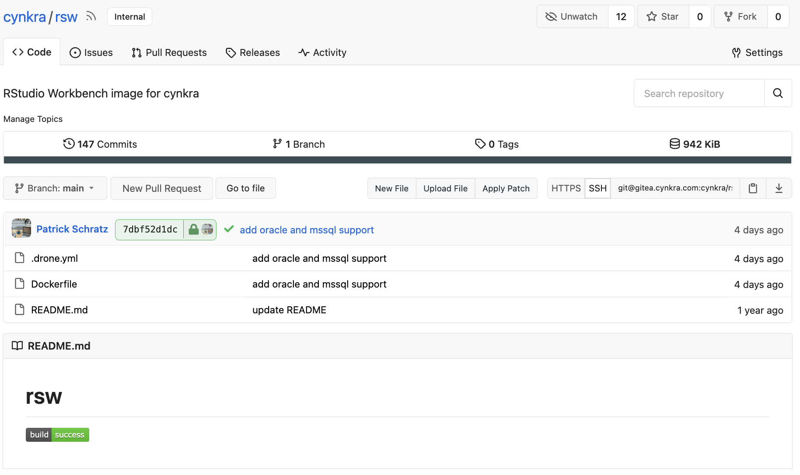
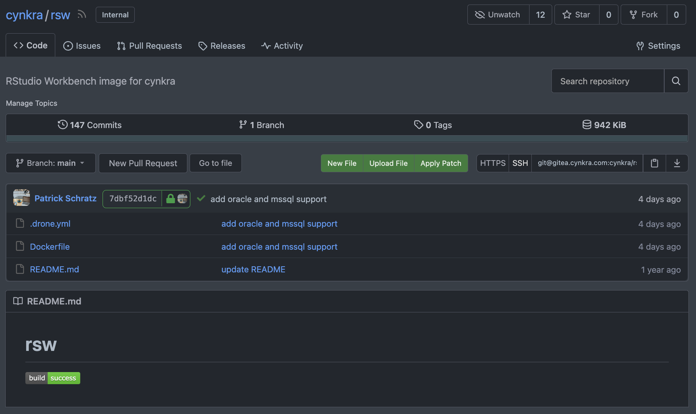

# MOVED TO https://codeberg.org/pat-s/gitea-github-theme

# gitea-github-theme

**Opinionated** GitHub-based light and dark themes for Gitea including an automatic theme switch option.

Created and tested with Gitea v1.15 - 1.17.
The theme might work with future versions though Gitea devs might change some CSS classes in the meantime and things might potentially look odd - just try yourself :)

I might update the theme over time to fix oversights and other issues - no guarantee though.

## Installation

1. If you do not have admin access to a Gitea instance, you can use the [Stylus](https://chrome.google.com/webstore/detail/stylus/clngdbkpkpeebahjckkjfobafhncgmne/related) browser extension and use the CSS provided in this repo for the Gitea URL
2. If you are an admin and want to make this theme available to all users:
   1. Put `theme-github.css` into `$GITEA_PUBLIC/public/css/theme-github.css` where `$GITEA_PUBLIC` is the "CustomPath" of your instance reported by `gitea help`.
   2. Add `github` to the comma-separated list in the setting `THEMES` in `app.ini`
   3. Now users can select this theme in their settings under "account"
   4. (optional) If you want to make this theme the default of your instance, set it in `DEFAULT_THEME` in `app.ini`

## Using automatic theme switching based on system preference

To use automatic theme switching, add `theme-github-auto.css` into your respective `themes` folder as described above.
This file contains both light and dark styles and selects the respective one based on the system preference selected by the user via the `@media (prefers-color-scheme:` CSS selector (tested on macOS).

For some reasons using `@imports` does not work and hence the file contains the c/p content of both the light and dark themes together.
If this is somehow possible and I did not managed to get it configured, please let me know!

## Changes to default Gitea theme

- Aligned primary green, grey, red and blue colors with GitHub
- Aligned `border-radius` with GitHub
- Related theme by removing a lot of hover colors and dominant button background-colors
- Aligned markup background to GitHub's value
- Decreased navbar height and font size
- Many small overrides of colors and font-sizes

## Helm chart instructions

To use custom themes with the [Gitea helm chart](https://gitea.com/gitea/helm-chart):

1. Create a secret containing the CSS files (here's an example via `terraform`, plain k8s secrets will also work)

```hcl
resource "kubernetes_secret" "gitea-themes" {
  metadata {
    name      = "gitea-themes"
    namespace = "gitea"
  }

  data = {
    "theme-github.css"      = "${file("files/gitea/gitea-github-theme-light.css")}"
    "theme-github-dark.css" = "${file("files/gitea/gitea-github-theme-dark.css")}"
    "theme-github-auto.css" = "${file("files/gitea/gitea-github-theme-auto.css")}"
  }

  type = "Opaque"
}
```

2. Mount the secret via `extraVolumes` in `values.yaml`:

```yml
extraVolumes:
  - name: gitea-themes
    secret:
      secretName: gitea-themes
```

3. Add the theme options into the config in `values.yaml`:

```yml
gitea:
  config:
    ui:
      DEFAULT_THEME: github-auto
      THEMES: auto,gitea,arc-green,github,github-dark,github-auto
```

## Screenshots




